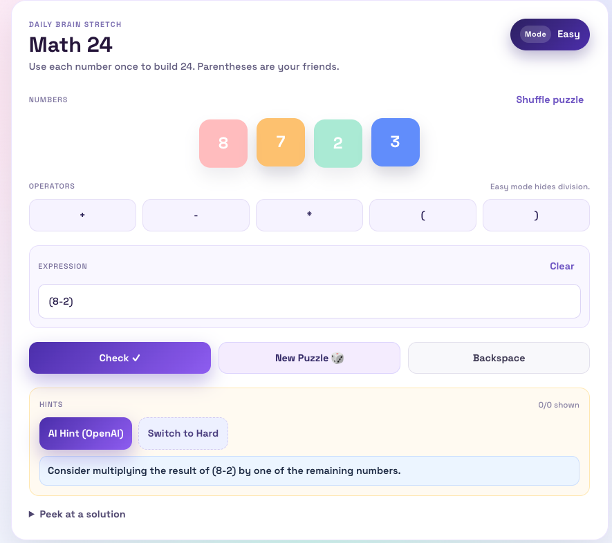

# AI_MATH24 🎯

## Introduction

**AI_MATH24** is a web-based math game designed to help kids practice logical thinking and arithmetic skills through the classic **24 Game**.

The game encourages:

* Mental math skills
* Problem-solving strategies
* Flexible thinking with numbers

To make learning more engaging and less frustrating, AI_MATH24 also provides **AI-powered hints** when players get stuck.

---

## Frontend

The frontend is built with modern web technologies to ensure a smooth and interactive user experience:

* **React** – component-based UI framework
* **TypeScript** – type-safe development for better reliability and maintainability

### Key Features

* Interactive number and operator buttons
* Support for parentheses `( )`
* Delete button to undo the last input
* Real-time expression building and evaluation
* Clean and kid-friendly UI

---

## Backend

The backend is responsible for game logic validation and AI-powered assistance.

### Tech Stack

* **Python**
* **FastAPI** – high-performance API framework
* **Gemini API** – provides intelligent hints and guidance

### Responsibilities

* Validate user expressions and results
* Ensure all four numbers are used correctly
* Generate step-by-step or strategic hints using AI
* Prevent directly giving away the final answer (hint-based learning)

The AI hint system is designed to **guide thinking**, not solve the problem outright, helping kids learn *how* to approach the solution.

---

## Goal

AI_MATH24 aims to combine **education + fun + AI** to create a safe, helpful, and effective math practice tool for kids.

Whether used at home or in a classroom setting, the game helps build confidence in math through play.

---

Happy solving! 🧠✨
